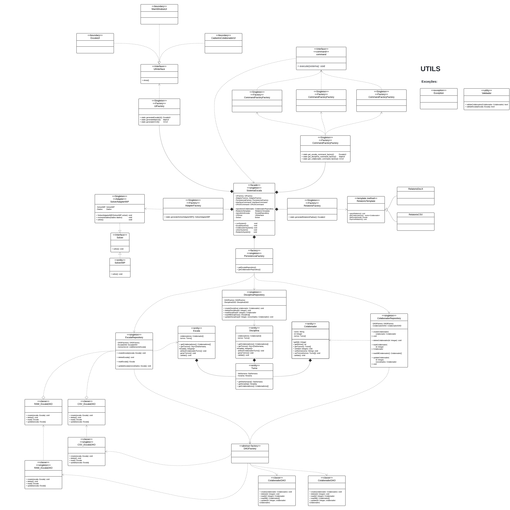

# AlocAi

Um projeto revolucionário do time:
- CAMILA EDUARDO COSTA DE VASCONCELOS
- LUCAS FARIAS DE MEDEIROS
- LUERSON DE ALBUQUERQUE SILVA FILHO
- LUIZ HENRIQUE QUEIROZ DE ALBUQUERQUE SILVA
- MAURO COIMBRA BARRETO COSTA NETO

O documento PDF do projeto está na pasta _docs_, com o nome
_MPS - Documento de Requisitos_. Eis também o [link](https://docs.google.com/document/d/1phRp_XBvOZptUZjW9JaLzN1W49IyciD4VusaA_fVoTE/edit?usp=sharing) de comentador para o documento no Google Docs.

## Como executar

Certifique-se de ter o Python instalado, assim como as dependências necessárias - especificadas em _requirements.txt_.

As dependências podem ser baixadas executando o seguinte comando no terminal:
```bash
pip install -r requirements.txt
```

Para rodar o projeto, execute o seguinte comando no terminal:
```bash
cd src/
python3 sistema_escala.py
```

## Diagrama C4: nível 1

<p align="center">
  
</p>

## Diagrama C4: nível 2

<p align="center">
  
</p>

## Diagrama C4: nível 3 - Comandos

<p align="center">
  
</p>

## Diagrama C4: nível 3 - Persistencia

<p align="center">
  
</p>

## Diagrama C4: nível 3 - Relatório

<p align="center">
  
</p>

## Diagrama C4: nível 3 - Sistema

<p align="center">
  
</p>

## Diagrama C4: nível 3 - SolverAdapter

<p align="center">
  
</p>

## Diagrama C4: nível 3 - UI

<p align="center">
  
</p>

## Diagrama de Classes

<p align="center">
  
</p>

